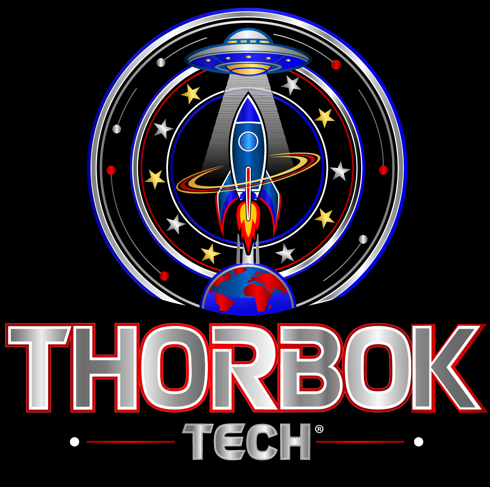
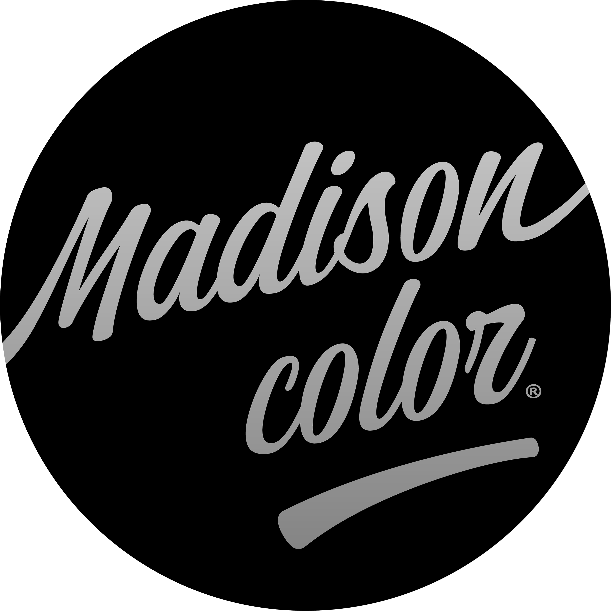

  
  

   
# Madison Color – Luminous Braille Wearable Interface System

## Overview

Madison Color is an inclusive fashion innovation integrating luminous braille technology into clothing.

This project aims to improve independence, safety, and communication for blind and visually impaired individuals through wearable technology.

---

## The Innovation

The system combines:

- tactile braille interaction
- light-emitting textile technology
- human-centered design

This dual-modality approach allows both tactile reading and visual signaling, enhancing accessibility and real-world usability.

---

## 🧪 Technical Approach

The system is based on the integration of tactile braille structures with light-emitting textile components.

The architecture explores:

- Embedded light-responsive materials  
- Energy-efficient signal activation  
- Wearable interface integration  
- Environmental interaction capabilities  

This concept is designed as a non-invasive, scalable wearable system.

---

## 🚀 Use Cases

- Low-visibility environments (night navigation)  
- Human-to-human signaling  
- Emergency identification systems  
- Smart wearable communication  
- Accessibility enhancement in public spaces

---

## 🔬 Research Potential

This concept opens potential research directions in:

- Smart textiles and responsive materials  
- Human-machine interaction  
- Wearable communication systems  
- Assistive technology innovation  
- Safety-enhancing garments  

The system can be adapted for advanced environments, including space-related human interface applications.

---

## ⚠️ Notice

This repository presents a conceptual and non-sensitive overview of the innovation.

Detailed technical implementation, materials, and proprietary methods are not disclosed.

Developed by Mason Ewing – Thorbok Tech.

---

## 🤝 Collaboration

Open to:

- Research collaborations  
- Institutional partnerships  
- Technology development  
- Investment opportunities  

Contact: thorboktech@masonewingcorp.com

---

## 🌍 Positioning

This project stands at the intersection of:

- Wearable Technology  
- Accessibility Innovation  
- Human Interface Systems

---

## 🛰️ Future Applications

Potential future applications include:

- Advanced safety garments  
- Smart communication systems  
- Integration in extreme environments  
- Exploration-related wearable interfaces

---

## Vision

Madison Color represents a new generation of inclusive fashion, merging design, technology, and social impact.

---

## Scientific Publication

DOI: https://doi.org/10.5281/zenodo.19141513

---

## Repository Purpose

This repository presents the concept, structure, and future development of the Madison Color project.

---

## Author

Mason Ewing  
Founder – Mason Ewing Corporation / Thorbok Tech
